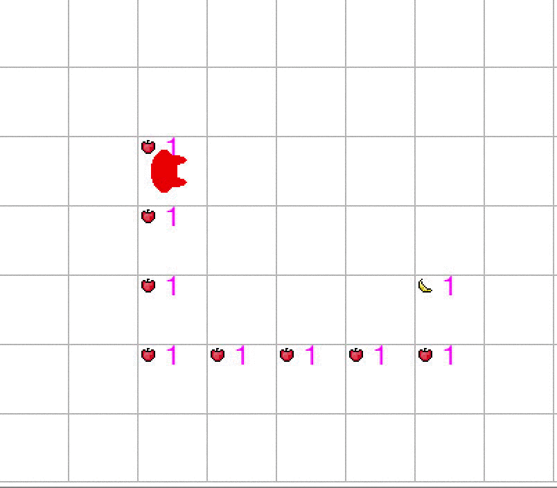

# Suivre le chemin

Kirby se trouve sur un terrain sans mur. Il se trouve sur une pomme et il y a un chemin de pommes qui permet d'atteindre une banane.

Ecrire un programme permettant à Kirby d'atteindre la banane.

hypothèse: Il y a au moins une case vide entre chaque pomme du chemin et le bord de la carte (il n'est donc pas nécessaire de vérifier la présence de murs).

