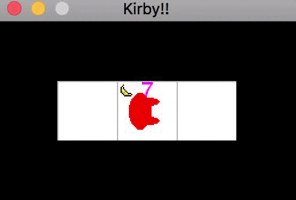

# Tri de fruits

Faites en sorte que Kirby sépare les pommes et les bananes qui se trouvent sous lui en deux tas distincts, les pommes sur la case de droite et les bananes sur la gauche.

hypothèse: Kirby se trouve dans un monde à 3 cases alignées et il se trouve initialement sur la case du milieu.

